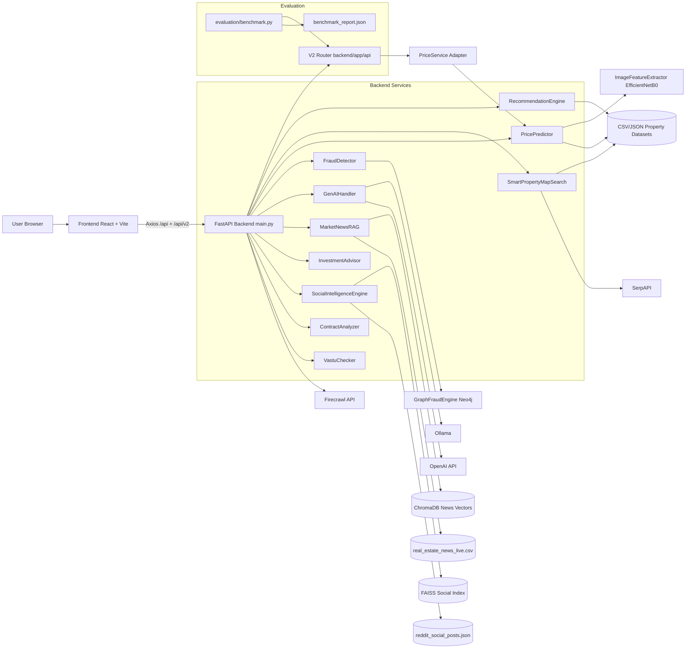
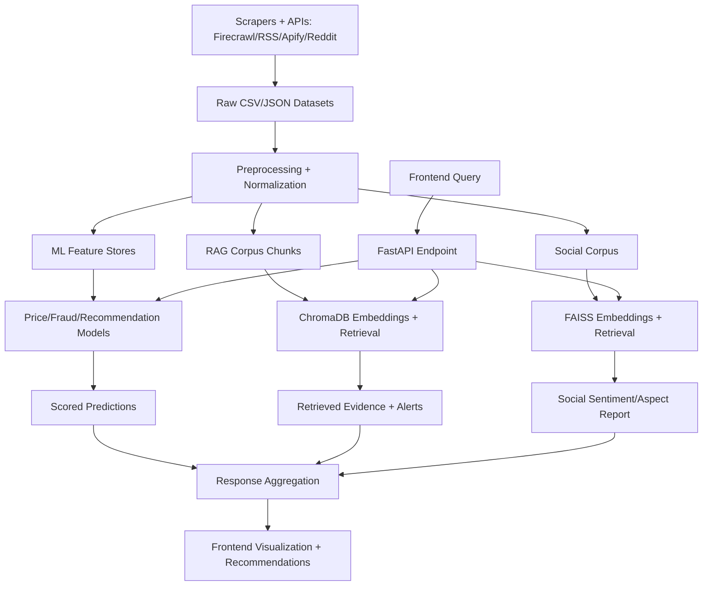
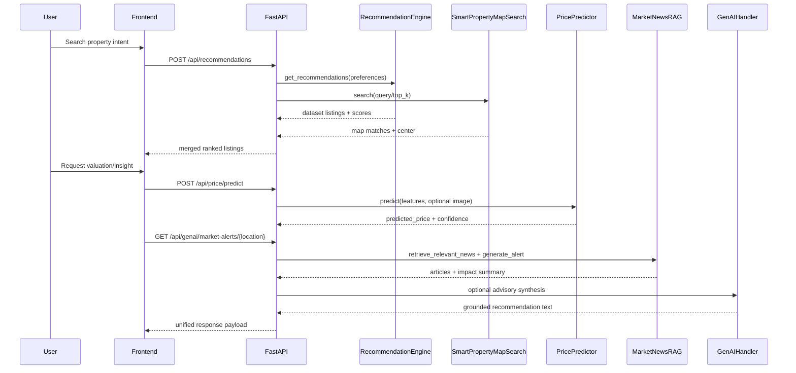

# Real Estate AI Platform Architecture (myNivas)

## 1. Overview
myNivas is a full-stack real estate intelligence platform that combines:
- A React + Vite frontend for search, analysis, and advisory workflows.
- A FastAPI backend that orchestrates classical ML, multimodal ML, RAG retrieval, and GenAI reasoning.
- Multiple retrieval/index layers (ChromaDB for market-news RAG and FAISS for social intelligence).
- External data/API integrations (Firecrawl, SerpAPI, OpenAI/Ollama, Reddit/Apify, Neo4j).

The architecture is modular at the service class level, with runtime orchestration still primarily centralized in `backend/main.py`.

Recent implementation update (non-breaking migration in progress):
- A new layered v2 slice has been introduced under `backend/app`:
  - `backend/app/core/providers.py` (DI-style provider, lazy singleton)
  - `backend/app/services/price_service.py` (service adapter layer)
  - `backend/app/api/schemas/price.py` (v2 request/response contracts)
  - `backend/app/api/routes/health.py`, `backend/app/api/routes/price.py` (v2 routes)
  - `backend/app/api/router.py` (router composition)
- `backend/main.py` now includes the v2 router via `app.include_router(v2_router)` while preserving all existing `/api/*` routes.

## 2. Architecture Layers

### 2.1 Data Layer
Primary responsibility: ingestion, normalization, and persistence of market/property/social data.

Core components:
- Static/semi-static datasets:
  - `Housing1.csv`, `Synthetic dataset.csv`
  - `Datasets/firecrawl_mumbai_properties.json`
  - `Datasets/firecrawl_mumbai_housing1.csv`
  - `Datasets/real_estate_news_live.csv`
  - `Datasets/reddit_social_posts.json`
- Data processing utility:
  - `backend/utils/data_processor.py`
- Ingestion jobs:
  - Firecrawl property ingestion: `backend/generate_firecrawl_mumbai_dataset.py`
  - News scraping: `backend/scrape_real_estate_news.py`
  - News to RAG load: `backend/load_market_news.py`
  - Social ingestion via Apify/Reddit: `backend/data_pipeline/reddit_ingestion.py`

External connectors in this layer:
- Firecrawl API (`FIRECRAWL_API_KEY`) for listing discovery/scraping.
- RSS + Google News feeds in news scraper.
- Apify actor (`APIFY_TOKEN`, `APIFY_REDDIT_ACTOR_ID`) with fallback to Reddit OAuth API.

Storage technologies used:
- File-based CSV/JSON stores for datasets and offline ingestion products.
- ChromaDB persistent stores for news RAG.
- FAISS local index + JSON metadata for social retrieval.
- Optional Neo4j graph DB for fraud relation intelligence.
- SQLite configured as default SQL URL (`sqlite:///./test.db`), with PostgreSQL-ready config path.

### 2.2 ML Layer
Primary responsibility: predictive scoring and feature-based intelligence.

Core models/services:
- Price prediction (tabular + visual multimodal):
  - `backend/models/price_predictor.py`
  - Uses GradientBoostingRegressor + StandardScaler + label encoders.
  - Uses image embeddings from EfficientNetB0 through `backend/models/image_feature_extractor.py`.
  - Applies market guardrails and city benchmark calibration post-prediction.
- Fraud detection:
  - `backend/models/fraud_detector.py`
  - Combines TF-IDF similarity, keyword/risk heuristics, text quality checks, and optional graph-based risk via Neo4j (`backend/models/graph_fraud_engine.py`).
- Recommendation scoring:
  - `backend/models/recommendation_engine.py`
  - Budget/location/BHK/amenity weighted scoring on loaded listing corpus.

Training/offline scripts present:
- `backend/train_models.py` (sklearn model suite experimentation).
- `backend/train_price_model.py` (price model training workflow).
- `backend/siamese_cnn.py` (deep learning Siamese CNN workflow).

### 2.3 RAG Layer
Primary responsibility: retrieval-augmented contextual intelligence from unstructured corpora.

Core RAG modules:
- Market news RAG:
  - `backend/models/market_news_rag.py`
  - Embeddings via SentenceTransformer; vectors in ChromaDB.
  - Hybrid retrieval: live SerpAPI news + local Chroma/CSV fallback.
  - Alert synthesis via impact scoring, signal extraction, timeline/source-mix calculations.
- Multi-domain RAG (extended domain retrieval):
  - `backend/models/multi_domain_rag.py`

Related retrieval systems:
- Social intelligence retrieval:
  - `backend/models/social/social_intelligence.py`
  - `backend/models/social/vector_store.py` (FAISS)
  - Pipeline: normalize -> retrieve -> sentiment/aspect analysis -> report.

### 2.4 Backend Layer
Primary responsibility: API gateway, orchestration, request validation, model serving.

Framework/runtime:
- FastAPI app in `backend/main.py`
- Pydantic request/response models in same module.

Layered v2 API path (new):
- `backend/app/api` for route modules and schemas.
- `backend/app/services` for orchestration/business adapters.
- `backend/app/core` for provider/wiring helpers.
- Current active v2 endpoints:
  - `GET /api/v2/health`
  - `POST /api/v2/price/predict`
  - `GET /api/v2/price/market-analysis/{location}`

Service composition in backend startup:
- `PricePredictor`, `FraudDetector`, `RecommendationEngine`, `GenAIHandler`, `ComparisonEngine`,
  `NeighborhoodEngine`, `AmenityMatcher`, `VastuChecker`, `InvestmentAdvisor`,
  `MarketNewsRAG`, `ContractAnalyzer`, `AgenticWorkflow`, `SmartPropertyMapSearch`,
  lazy `SocialIntelligenceEngine`, `DataProcessor`.

Integration style:
- Synchronous service methods for most requests.
- Async bridge (`asyncio.to_thread`) for CPU-heavy prediction calls.
- Startup background thread for periodic market-news refresh and reload.
- Dual-route mode for migration: legacy `/api/*` and new `/api/v2/*` are served together.

### 2.5 Frontend Layer
Primary responsibility: user interaction and visualization across search/advisory use-cases.

Framework/runtime:
- React 18 + Vite (`frontend/package.json`)
- Router: React Router (`frontend/src/App.jsx`)
- API client: Axios (`frontend/src/utils/api.js`)

Major page modules:
- Search: `frontend/src/pages/Search.jsx` -> `/api/recommendations`
- Home Smart Discovery: `frontend/src/pages/Home.jsx` -> `/api/genai/cross-modal-match`
- Price Analyzer: `frontend/src/pages/PriceAnalyzer.jsx` -> `/api/price/predict`
- Fraud Detector, Social, Market News, Contract Analyzer, Investment Analyzer, Vastu Checker, Advisor Chat.

## 3. Core Component Breakdown

### A) Data Layer
- Property datasets are merged from local CSV and Firecrawl outputs inside recommendation and map-search paths.
- News data is scraped/aggregated and loaded into ChromaDB collection `market_news`.
- Social posts are ingested from Apify or Reddit API and indexed into FAISS for semantic retrieval.
- Neo4j graph captures broker-phone-image relationships for fraud graph scoring.

### B) ML Layer
- Price model is multimodal:
  - Tabular features: location/BHK/size/furnishing/status/amenity-count.
  - Visual features: EfficientNet embeddings.
  - Prediction then calibrated against city-level benchmark guardrails.
- Fraud model is hybrid:
  - Textual duplicate/suspicion scoring + optional relational graph risk.
- Recommendation model is weighted heuristic ranking with strict pre-filters.

### C) RAG Layer
- Embedding generation:
  - SentenceTransformer local or configured model path.
- Vector storage:
  - ChromaDB for market news corpus.
  - FAISS for social corpus.
- Retrieval logic:
  - MarketNewsRAG: query embedding + metadata filtering + live news blending + reranking.
- Generation:
  - Alert synthesis and recommendation text produced with structured summarization logic and optional LLM guardrails.

### D) Backend Layer
- FastAPI endpoints expose all capabilities under `/api/*`.
- Business logic sits in service classes under `backend/models`.
- `main.py` orchestrates: validation -> service invocation -> response shaping.
- Agentic orchestration (`/api/agentic/analyze`) uses LangGraph sequence:
  valuation -> fraud -> market intelligence -> advisory.

### E) Frontend Layer
- User captures structured and natural-language intents.
- Axios client maps page actions to backend endpoints.
- UI renders ranked listings, confidence/score outputs, map context, and generated insights.

### F) Evaluation Layer (new)
Primary responsibility: provide repeatable performance checks for newly introduced API paths.

Current benchmark utilities:
- `evaluation/benchmark.py`:
  - Runs request-loop benchmarks against `POST /api/v2/price/predict`.
  - Produces request-level success/failure and latency report JSON.
- `evaluation/metrics.py`:
  - Computes summary metrics (`mean`, `p50`, `p95`, `max`, success-rate percent).
- `evaluation/test_queries.json`:
  - Seed payload set for consistent benchmark input.

## 4. End-to-End Data Flow (Most Important)

### Scenario: user searches for a property
Step-by-step runtime path:
1. User submits filters or NL query from Home/Search UI.
2. Frontend sends API call:
   - Structured search: `POST /api/recommendations`
   - Cross-modal NL search: `POST /api/genai/cross-modal-match`
3. Backend validates input with Pydantic model.
4. For structured recommendations:
   - `RecommendationEngine.get_recommendations(preferences)` produces dataset-driven ranked candidates.
   - `SmartPropertyMapSearch.search(...)` optionally adds live map-centric matches (SerpAPI-backed if configured).
   - Backend normalizes both result sets into a unified listing schema.
   - De-duplication by normalized title+location key.
   - Global ranking by `match_score`; top N returned with map center payload.
5. For cross-modal path:
   - Query parsing extracts location/property-type/budget/features/tokens.
   - Candidate filtering + feature matching + similarity scoring.
   - Top matches returned with coordinates and parsed requirement trace.
6. If user opens a property detail:
   - Frontend calls `POST /api/properties/enrich`.
   - Backend enriches with comparison (`ComparisonEngine`), similar listings (`RecommendationEngine`), map center (SmartPropertyMapSearch fallback), and optional Firecrawl reference match/scrape fallback.
7. Optional downstream analytics from property page:
   - Price prediction (`/api/price/predict`) invokes multimodal ML.
   - Fraud detection (`/api/fraud/detect`) invokes hybrid fraud engine.
   - Market alerts (`/api/genai/market-alerts/{location}`) invoke RAG retrieval + alert synthesis.
8. Frontend visualizes final payloads (scores, reasons, trends, maps, recommendations).

### ML + RAG orchestration in advisory workflows
- `/api/agentic/analyze` runs sequential orchestration:
  - Price predictor output (valuation).
  - Fraud detector output (trust/risk).
  - RAG market summary (news intelligence).
  - GenAI advisory synthesis with guardrails.

## 5. Mermaid Diagrams

### 5.1 System Architecture Diagram

### 5.2 Data Flow Diagram

### 5.3 Component Interaction Diagram (Runtime)

## 6. Component Interaction and Dependency Trace

### 6.1 Endpoint -> Service dependencies
- `/api/recommendations` -> `RecommendationEngine` + `SmartPropertyMapSearch`
- `/api/properties/enrich` -> `RecommendationEngine` + `ComparisonEngine` + `SmartPropertyMapSearch` + Firecrawl helpers
- `/api/price/predict` -> `PricePredictor` -> `ImageFeatureExtractor`
- `/api/v2/price/predict` -> `PriceService` -> `PricePredictor` -> `ImageFeatureExtractor`
- `/api/v2/price/market-analysis/{location}` -> `PriceService` -> `PricePredictor.analyze_market`
- `/api/v2/health` -> lightweight route check
- `/api/fraud/detect` -> `FraudDetector` -> `GraphFraudEngine` (Neo4j optional)
- `/api/genai/*` endpoints -> `GenAIHandler` (with `InvestmentAdvisor` composition)
- `/api/genai/market-alerts/*` -> `MarketNewsRAG` (Chroma + live feeds)
- `/api/social-analysis` -> `SocialIntelligenceEngine` -> `SocialVectorStore` (FAISS) + sentiment/report modules
- `/api/agentic/analyze` -> `AgenticWorkflow` -> price/fraud/news/genai sequence

### 6.2 Service -> Data/Infra dependencies
- `RecommendationEngine` -> `Housing1.csv`, Firecrawl CSV
- `PricePredictor` -> `Synthetic dataset.csv`, model pickle, image directory
- `MarketNewsRAG` -> Chroma persist dir + CSV news + SerpAPI (optional)
- `SocialIntelligenceEngine` -> Reddit JSON store + FAISS index + sentence-transformers
- `GraphFraudEngine` -> Neo4j driver/service

### 6.3 Tight coupling vs loose coupling
Loose-coupling strengths:
- Most intelligence components are class-based and can run independently.
- External providers have graceful fallback paths (e.g., Ollama/OpenAI fallback, RAG->CSV fallback, Apify->Reddit fallback).
- The new v2 slice introduces clearer separation between routes, service adapters, and dependency providers.

Tight-coupling hotspots:
- `backend/main.py` centralizes many responsibilities (routing + orchestration + startup jobs + helper logic).
- Service lifecycle and dependency wiring are hardcoded at import/startup time, reducing testability and deployment flexibility.
- Duplicate endpoint definition exists for `/api/vastu/check` in the same module, increasing maintenance risk.

Migration status:
- Refactor has started via additive v2 routing (no breaking changes).
- Current extraction scope is valuation endpoints; other domains still routed through `main.py`.

## 7. ML + RAG Integration Analysis

How ML outputs influence recommendations:
- Directly: user can call ML pricing endpoint to validate listing fairness.
- Indirectly: in agentic workflow, valuation + fraud + RAG signals are fused into final advisory text.
- Current recommendation ranking path itself is mostly heuristic/content-based and not tightly fused with predicted fair-price deltas.

How RAG improves over keyword-only search:
- Embedding retrieval surfaces semantically related market events even when exact keywords differ.
- Hybrid strategy (live news + vector retrieval + date/impact/rank filtering) captures recency and context better than plain keyword match.
- Alert synthesis provides explainable summaries (signals, timeline, source mix, confidence).

Sequential vs parallel ML/RAG usage:
- In `agentic_workflow`, components are sequential by design:
  valuation -> fraud -> market intelligence -> advisory.
- In non-agentic endpoints, modules are invoked per-route independently; frontend can combine results in user flow.

## 8. Design Decisions (Why These Choices)

Why RAG:
- Market context changes frequently; static prompts or pure keyword filters become stale quickly.
- RAG enables traceable evidence-backed alerts using recent corpus and live pull-ins.

Why current ML approach:
- Gradient boosting for price offers robust performance on mixed engineered features with low serving cost.
- Fraud heuristics + TF-IDF are interpretable and efficient; optional graph analytics adds relational anomaly signal.

Why external APIs:
- SerpAPI enriches map and live-news freshness.
- Firecrawl expands listing coverage beyond static datasets.
- OpenAI/Ollama provide flexible GenAI generation with local/cloud fallback.

## 9. Scalability Considerations

Current bottlenecks:
- Monolithic API process loads many heavy services in one runtime.
- Background refresh thread inside web process can contend with request workload.
- File-based datasets and local vector stores limit multi-instance consistency.
- Some service initializations are eager and startup-heavy.

Scaling path:
- Split into service domains:
  - Search/Recommendation service
  - Price/Fraud scoring service
  - RAG/News intelligence service
  - Social intelligence service
- Move ingestion jobs to async workers/queues (Celery/RQ/Kafka consumers).
- Promote storage:
  - Postgres for transactional property metadata.
  - Managed vector DB (or centralized Chroma service) for multi-instance retrieval.
  - Redis cache for hot queries and embedding cache.
- Add API gateway + request tracing + rate limiting + observability.

## 10. Architectural Improvements

### 10.1 Structural improvements
- Refactor `backend/main.py` into routers + dependency-injected service container.
- Introduce explicit domain boundaries (`search`, `valuation`, `fraud`, `rag`, `social`, `contracts`).
- Replace global singleton initialization with lifecycle-managed providers.

Implementation progress update:
- Completed: first DI/provider + service-adapter extraction for valuation in `backend/app/*`.
- Completed: non-breaking v2 router integration in `backend/main.py`.
- Pending: expand the same pattern to search, fraud, RAG, social, and contract domains.

### 10.2 Performance improvements
- Cache embedding calls and frequent retrieval responses.
- Precompute and persist recommendation feature matrices.
- Add batched async I/O for external API lookups.
- Decouple periodic refresh from API process into scheduler/worker.

### 10.3 ML + RAG integration improvements
- Add composite ranking score combining:
  - recommendation match score
  - price fairness delta (predicted vs listed)
  - fraud trust score
  - market/news sentiment impact
- Build a unified relevance contract so all modules emit calibrated scores on common scale.
- Extend evaluation beyond latency/success into ranking quality, fraud precision/recall, and RAG retrieval precision dashboards.

Current evaluation status:
- Implemented MVP benchmark harness for `/api/v2/price/predict` latency and request success tracking.

### 10.4 Reliability and governance
- Add schema contracts for dataset ingestion artifacts.
- Add endpoint-level contract tests for critical orchestration paths.
- Add model/version registry metadata and rollback strategy.
- Add explicit fallback telemetry (which provider/path served the response).

## 11. Quick Dependency Matrix

| Module | Depends On | Type |
|---|---|---|
| `main.py` | All service classes in `backend/models` | Runtime composition |
| `PricePredictor` | sklearn + EfficientNet extractor + dataset files | ML inference |
| `FraudDetector` | TF-IDF + GraphFraudEngine (Neo4j) | Hybrid fraud scoring |
| `RecommendationEngine` | CSV/Firecrawl data | Heuristic ranking |
| `MarketNewsRAG` | SentenceTransformer + Chroma + live news feeds | RAG retrieval |
| `GenAIHandler` | Ollama/OpenAI + InvestmentAdvisor | Text generation/orchestration |
| `SocialIntelligenceEngine` | FAISS + embeddings + sentiment/report modules | Social RAG-like pipeline |
| `AgenticWorkflow` | Price + Fraud + MarketNewsRAG + GenAIHandler | Sequential orchestration |

## 12. Summary
myNivas already demonstrates a strong applied architecture for a capstone: real endpoint breadth, practical ML, retrieval augmentation, and multiple external data channels. The main opportunity is not feature coverage, but systemization: decomposing orchestration, standardizing scoring contracts, and hardening deployment-scale data/compute boundaries.
